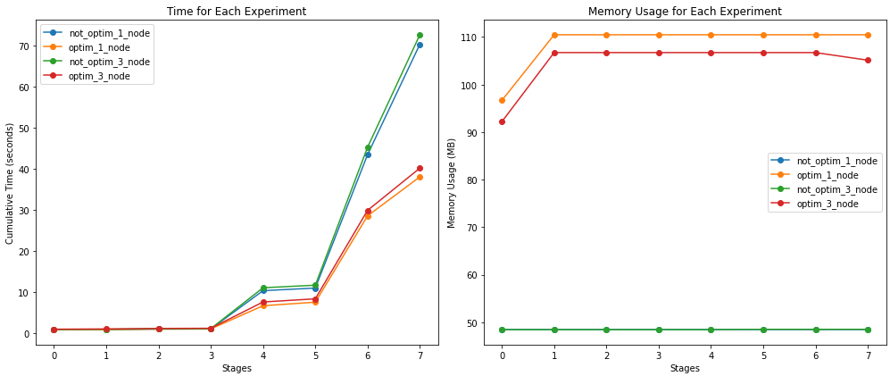

Hadoop-Spark-ML
=======

Results
---


* Can be visual bug in dark theme of github, axis names are presented. Left is time, right is memory.
How to run
---
Firstly, [download](https://jmcauley.ucsd.edu/data/amazon_v2/categoryFilesSmall/Musical_Instruments_5.json.gz) dataset. It's Amazon Reviews 2018 data, 5-core subsample of Musical instrumets goods (231,392 reviews). You can look at it in [preprocess.ipynb](preprocess.ipynb)

## 1 Datanode
Load data and config to HDFS
```bash
docker-compose up -d
docker cp Musical_Instruments_5.parquet namenode:Musical_Instruments_5.parquet
docker cp configs/hadoop/hdfs-site.xml namenode:hdfs-site.xml
docker exec -it namenode /bin/bash
hdfs dfs -mkdir -p /user/root/data
hdfs dfs -put hdfs-site.xml  /user/root/data/hdfs-site.xml
hdfs dfs -put Musical_Instruments_5.parquet /user/root/data/Musical_Instruments_5.parquet
exit
```
Load python files to spark worker 
```bash
docker cp spark_app.py spark-worker-1:spark_app.py
docker cp utils.py spark-worker-1:utils.py 
docker exec -it spark-worker-1 bash
```
Run not spark optimized experiment:
```bash
spark/bin/spark-submit spark_app.py
```
Run spark optimized experiment:
```bash
spark/bin/spark-submit spark_app.py -o
```
At the end, exit and stop the container:
```bash
exit
docker-compose down
```

## 3 Datanodes
Execute same commands, but compose another container:
```bash
docker-compose -f docker-compose3d.yml up -d
# Next steps are the same 
```
Run not spark optimized experiment:
```bash
spark/bin/spark-submit spark_app.py -n 3
```
Run spark optimized experiment:
```bash
spark/bin/spark-submit spark_app.py -n 3 -o
```

At the end, exit and stop the container:
```bash
exit
docker-compose -f docker-compose3d.yml down
```
